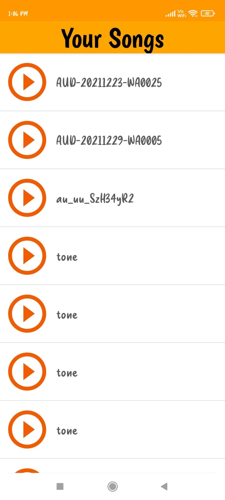

# SimpleMusicPlayer :star_struck: 

[](https://shields.io/) [](https://shields.io/) [](https://shields.io/) [](https://shields.io/) [](https://shields.io/) [](https://shields.io/) [](https://shields.io/) [](https://shields.io/) 

***This new android application named 'Simple Music Player App' is created by Biswarup Bhattacharjee, student of BTECH, in University of Engineering and Management, Kolkata.***

**Email Id: bbiswa471@gmail.com.** 

**Contact No: 916290272740.** 

<p align="left">
<a href="https://www.facebook.com/profile.php?id=100070395300810" target="blank"></a>
<a href="https://instagram.com/biswarup2210" target="blank"></a>
<a href="https://github.com/biswa2210/biswa2210" target="blank"></a>
</p>

## About :point_down: 

<div align="justified">
 
Simple Music Player App is created using java. After installing this app when we open it, it asks for a permission to access all the media in that device. Once the permission is granted all the musics in that device are shown in a list view. If we click on a music it starts playing. Even if we press back and the app is open in background the musics will be played. We can chenge seek and also change music. If we don't change the musics will be played one after another in queue. So, this app gives user an uninterrupted listening to musics which exist in device storage. This app is user-friendly and totally safe to use.

</div>

## APP DOWNLOAD LINK : :point_right: <a href="https://drive.google.com/file/d/1Uve2P9PPDewTUJE70NfiXdheH0O0vl8n/view" download>Click here to download</a>

## SM PLAYER DEMO VIDEO: :point_right: <a href="https://www.youtube.com/watch?v=ZbMf74Yta8M">Click here to watch</a>

## ANDROID PLAYLIST: :point_right: <a href="https://www.youtube.com/watch?v=Jfq38C1hKXs&list=PL0lbDlMJ1h4hiR-xQJTPRijsOF1-0hhAG">Click here to watch</a>

## Purpose :point_down:

<div align="justified">
       
I have made this simple music android application for people to listen musics of their deice easily and uninterruptedly.
</div>
       
## Importance :point_down:

<div align="justified">

Listening music is very useful for relaxing. Many people love to listen music. This app will help them listen music easily without any problem. This is offline someone loses internet connection then also they can enjoy device's musics.
 
</div>

## Folder Structure :point_down:
```bash
simple music player
      └── app
           └── src
                ├── androidTest/java/com/example/simplemusicplayer
                |                                       └── ExampleIntrumentedTest.java
                └── main
                      └── java/com/example/simplemusicplayer
                                     ├── MainActivity.java
                                     ├── CustomListView.java
                                     ├── SplashActivity.java
                                     └── PlaySongAct.java   
 ```                      
## Making :point_down:

<div align="justified">

I have made this app using java in android studios. 

</div>


## Screenshots :point_down: 

<div align="center">
  
<a href="pics/SM1.jpeg"></a> <a href="pics/SM2.jpeg"></a> <a href="pics/SM3.jpeg"></a>
       
</div>


